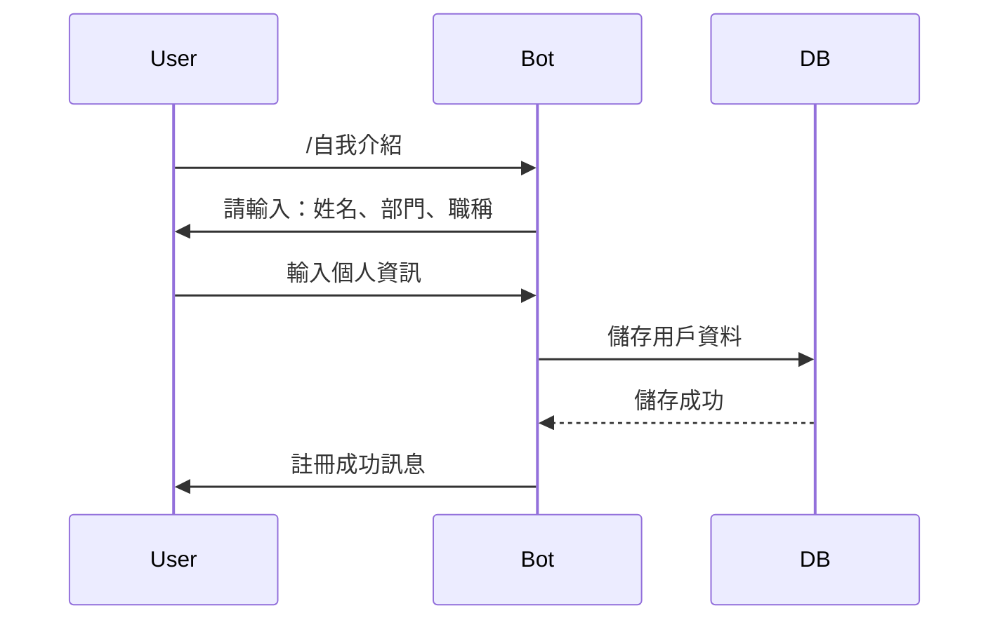
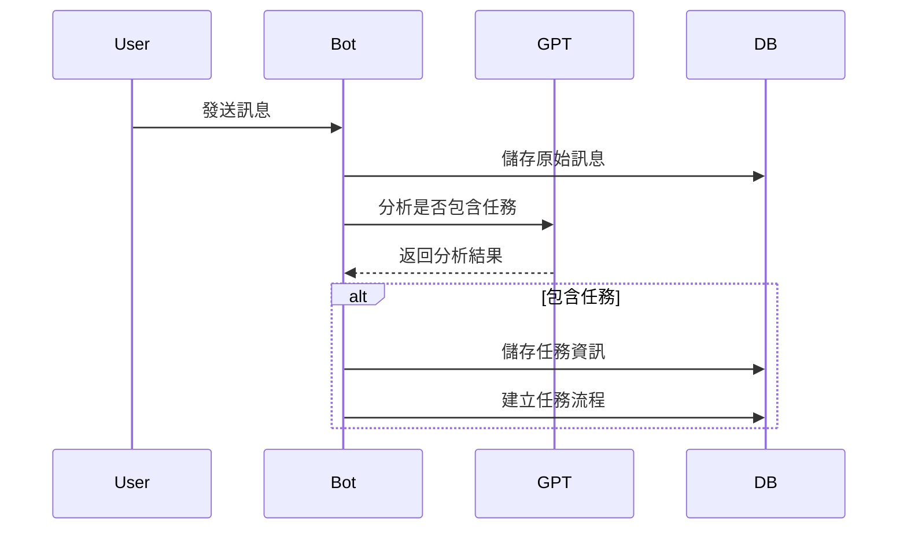
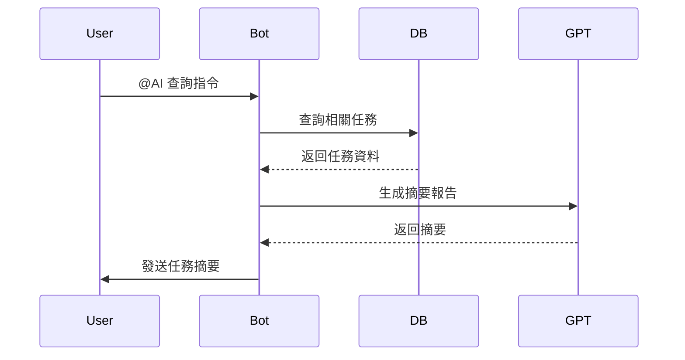
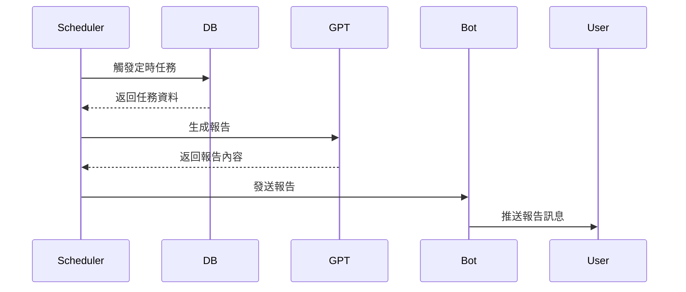
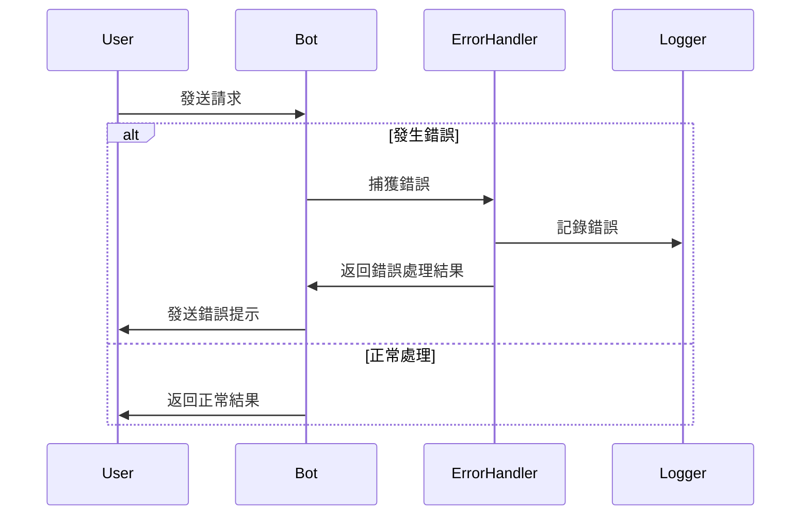
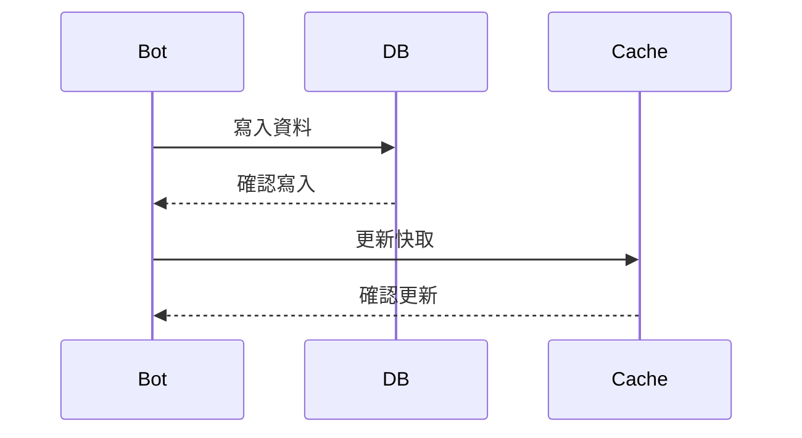
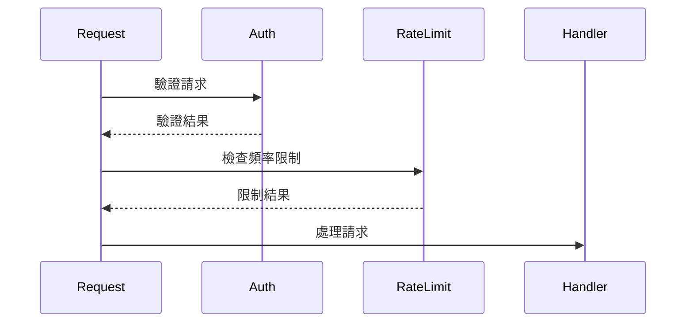
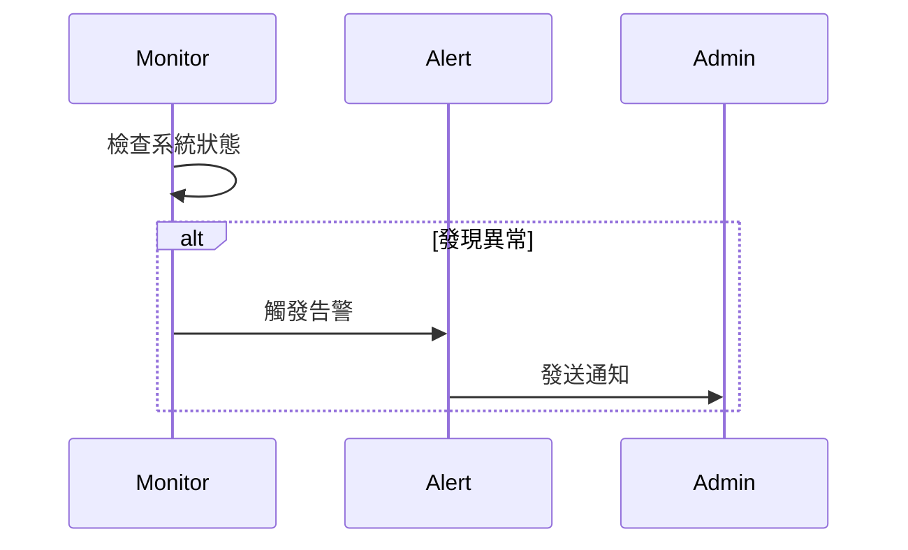

# API 流程文件

## 1. 用戶註冊流程

```mermaid
sequenceDiagram
    participant User
    participant Bot
    participant DB
    
    User->>Bot: /自我介紹
    Bot->>User: 請輸入：姓名、部門、職稱
    User->>Bot: 輸入個人資訊
    Bot->>DB: 儲存用戶資料
    DB-->>Bot: 儲存成功
    Bot->>User: 註冊成功訊息
```

## 2. 任務識別流程

```mermaid
sequenceDiagram
    participant User
    participant Bot
    participant GPT
    participant DB
    
    User->>Bot: 發送訊息
    Bot->>DB: 儲存原始訊息
    Bot->>GPT: 分析是否包含任務
    GPT-->>Bot: 返回分析結果
    alt 包含任務
        Bot->>DB: 儲存任務資訊
        Bot->>DB: 建立任務流程
    end
```

## 3. 任務查詢流程

```mermaid
sequenceDiagram
    participant User
    participant Bot
    participant DB
    participant GPT
    
    User->>Bot: @AI 查詢指令
    Bot->>DB: 查詢相關任務
    DB-->>Bot: 返回任務資料
    Bot->>GPT: 生成摘要報告
    GPT-->>Bot: 返回摘要
    Bot->>User: 發送任務摘要
```

## 4. 定時報告流程

```mermaid
sequenceDiagram
    participant Scheduler
    participant DB
    participant GPT
    participant Bot
    participant User
    
    Scheduler->>DB: 觸發定時任務
    DB-->>Scheduler: 返回任務資料
    Scheduler->>GPT: 生成報告
    GPT-->>Scheduler: 返回報告內容
    Scheduler->>Bot: 發送報告
    Bot->>User: 推送報告訊息
```

## 5. 錯誤處理流程

```mermaid
sequenceDiagram
    participant User
    participant Bot
    participant ErrorHandler
    participant Logger
    
    User->>Bot: 發送請求
    alt 發生錯誤
        Bot->>ErrorHandler: 捕獲錯誤
        ErrorHandler->>Logger: 記錄錯誤
        ErrorHandler->>Bot: 返回錯誤處理結果
        Bot->>User: 發送錯誤提示
    else 正常處理
        Bot->>User: 返回正常結果
    end
```

## 6. 資料同步流程

```mermaid
sequenceDiagram
    participant Bot
    participant DB
    participant Cache
    
    Bot->>DB: 寫入資料
    DB-->>Bot: 確認寫入
    Bot->>Cache: 更新快取
    Cache-->>Bot: 確認更新
```

## 7. 安全性檢查流程

```mermaid
sequenceDiagram
    participant Request
    participant Auth
    participant RateLimit
    participant Handler
    
    Request->>Auth: 驗證請求
    Auth-->>Request: 驗證結果
    Request->>RateLimit: 檢查頻率限制
    RateLimit-->>Request: 限制結果
    Request->>Handler: 處理請求
```

## 8. 監控告警流程

```mermaid
sequenceDiagram
    participant Monitor
    participant Alert
    participant Admin
    
    Monitor->>Monitor: 檢查系統狀態
    alt 發現異常
        Monitor->>Alert: 觸發告警
        Alert->>Admin: 發送通知
    end
``` 